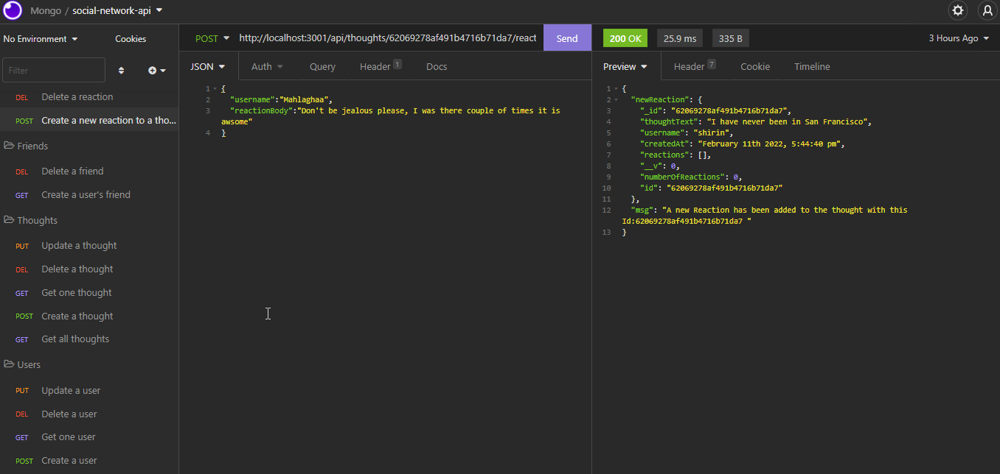

<div style="text-align:center"></a></div>

<h1>social-network-api
</h1>

<h2>Table of Content</h2>

- [Project Link](#project-link)
- [Getting Started](#getting-started)
- [Contributors](#contributor)
- [About The project](#about-the-project)

  - [User Flow](#user-flows)
  - [Technologies Used](#technologies-used)

### Project Link

- Please click [here](https://github.com/Amir-Fard2025/social-network-api/tree/dev) to see the contents of our project in Github
- [here]() you have the access to video link

### Getting Started

```
git clone
cd social-network-api
code .
git checkout dev
npm i
npm run dev
open Insomnia
check the CRUD operations


```

### Contributor

- Amir : https://github.com/Amir-Fard2025

### About The Project

<p>This application uses MongoDB database to build an api for social network application.
</p>

#### User Flow

<p>the user can add user, the friends of users and even change the friends.It is possible for each user to have thought and it is possible to add reaction to each thought</p>

#### Technologies Used

<p>The following technologies are implemented in this project:</p>

-Javascript
-Express.js
-Mongo DB
-Mongoos
-Moment.js
-Nodemon
-Insomnia

#### Web APIs

- The following APIs are implemented in this project:
- [](google maps)
- []()

#### Wireframes

> Note:
> The structure of the code has been built According to the main flowcharts; however there could be some slight changes during the developing process


#### Plans For Improvement

<p>The following mission are our next steps: </p>

- Many2Many relation
- Design improvement for profile page
- Add rating and comments section for clients
- Add online payment support
- Make the project universal to cover more professions
